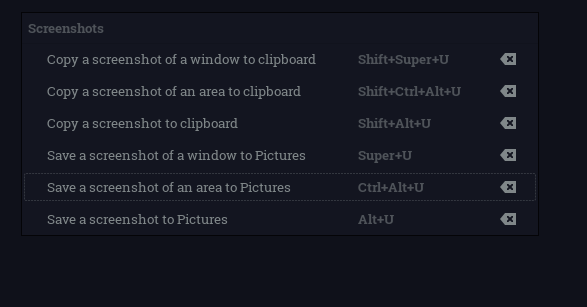

# Pop-os - Gnome - Tmux - Fish - Vim - FZF - Serious Configuration - Shawn Anderson
These are the dotfiles that I hack on. Can easily be installed to your ~/.config/ by using the gnu stow utility.

  

To install:  
1. Requirements
	
	sudo apt install stow xcape
	
2. Clone the repo  

	git clone git@github.com:LinuxIsCool/configuration.git  
	
3. Symlink into ~/.config using stow  

	cd configuration  
	sh stow
	
	
# Popos-Gnome
In addition to the script-based configuration, I'll do my best to track and document my debian-gnome-popos settings, to make them as reproducable as possible.

Aesthetic-wise, I'm currently using the Juno-Ocean Gnome theme, as per recommended by @mattcoding4days, and my vim theme is quantum, as per Matt's recommendation as well.

# Keyboard-driven screenshoting
I used the following mnemonics for shortcuts across my system. I use alt-u as the base for screenshots because function-u is the default print-screen on my keyboard.

| Key                            | Shift | Ctrl        | Super  | Alt    |
|--------------------------------|-------|-------------|--------|--------|
| Mnemonic                       | Move  | Select Area | Window | Screen |
|--------------------------------|-------|-------------|--------|--------|
| Screenshot Area to Clipboard   | *     | *           |        |        |
| Screenshot Window to Clipboard | *     |             | *      |        |
| Screenshot Screen to Clipboard | *     |             |        | *      |
| Screenshot Area to Pictures    |       | *           |        |        |
| Screenshot Window to Pictures  |       |             | *      |        |
| Screenshot Screen to Pictures  |       |             |        | *      |

